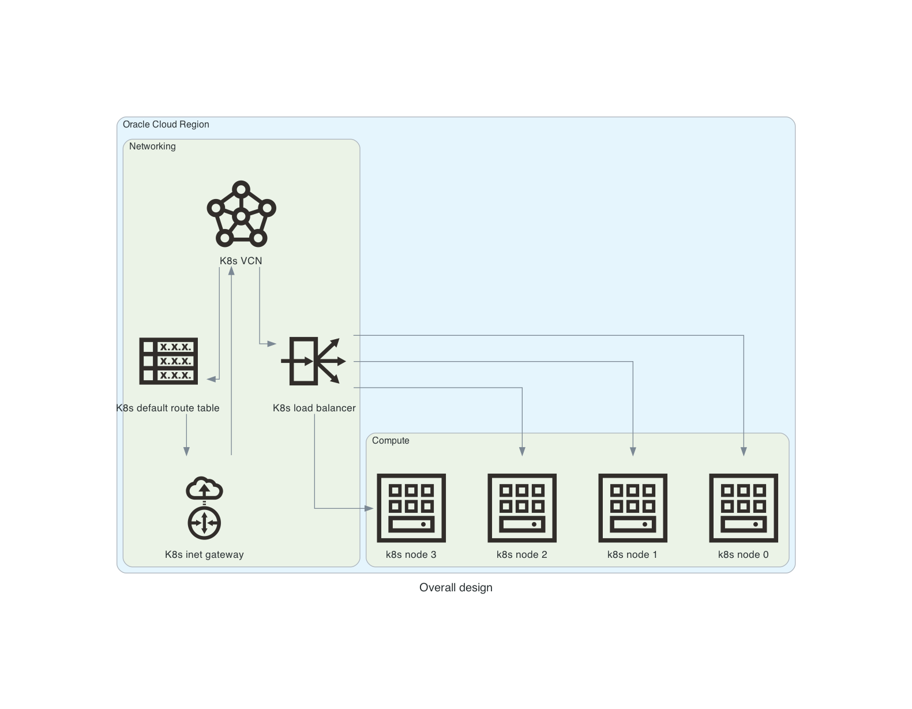

# k8s-oci

Repository contains set of prepared code to deploy free Kubernetes cluster in Oracle Cloud Infrastructure (OCI) and it's using:
* Terraform to provision infrastructure
* Ansible to configure compute instances and setup K8s cluster

Moreover there was prepared
* Python application deployed by pipeline in created K8s cluster
* GitHub Actions for CI/CD pipeline
* Helm charts used to deployed application

For future there are plans to extend repository by adding:
* Extended pipeline with automated tests
* Integration with AWS services

## Overall design

Code to deploy and configure free Kubernetes cluster in Oracle Cloud is based on idea of [Tomek's free ebook „Jak utworzyć całkowicie darmowy klaster Kubernetes w chmurze”](https://cloudowski.com/e-book-jak-utworzyc-calkowicie-darmowy-klaster-kubernetes-w-chmurze).

At first it was prepared schema to present what is being configured in Oracle Cloud. Overall desing was prepared using [Diagram as Code](https://diagrams.mingrammer.com/), which can be installed using commands:

```
cd design
python3 -m venv venv
source venv/bin/activate
pip install -r requirements.txt
```

Diagram is generated as PNG using command:

```
python overall_design.py
```

Overall desing consists of compute nodes, virtual network, loab balancer, route table and Internet gateway:



## Infrastructure

In order to setup infrastructure in OCI using Terraform, you can use below documentation to find more information:
* [Oracle documentation](https://docs.oracle.com/en-us/iaas/developer-tutorials/tutorials/tf-simple-infrastructure/01-summary.htm)
* [Terraform documentation](https://learn.hashicorp.com/collections/terraform/oci-get-started)
* [OCI provider](https://registry.terraform.io/providers/oracle/oci/latest)

After installing ``Terraform CLI`` and ``OCI CLI``, the first step was to authenticate in Oracle Cloud and save session in profile ``k8s-oci``:

```shell
oci session authenticate
.........
Enter the name of the profile you would like to create: k8s-oci
.........
```

Created session credentials can be checked by command:

```shell
oci iam region list --config-file /Users/seba/.oci/config --profile k8s-oci --auth security_token
```

Token can be later refreshed by command:

```shell
oci session refresh --profile k8s-oci
```

Whole infrastacture as a code was prepared in [infra](infra) directory.

At first Terraform needs to initialized:

```shell
cd infra
terraform init
```

Then changes to be provisioned can be checked using:

```
terraform plan
```

All variables defined in [variables.tf](infra/variables.tf) contain default values besides 2 variables:
- ``compartment_id``
- ``my_public_ip``

First value you can take from [Oracle Cloud web console](https://cloud.oracle.com/identity/compartments).
My public IP address you can get using command:

```
echo "my_public_ip = \"`curl -s ifconfig.co`/32\"" 2> /dev/null 1>> terraform.tfvars
```

At the end whole configuration can be provisioned by command:

```
terraform apply -auto-approve
```

In order to check current state, you can use command:

```
terraform show
```

After configuring all elements from overall design, in Terraform output you will get all details required to configure Kubernetes cluster.

```
terraform output
```

Moreover there will be generated automatically:
- ``inventory.ini`` - Ansible inventory from [template](infra/inventory.tmpl)
- ``vars.yml`` - Ansible varialbes from [template](infra/vars.tmpl)
- ``ssh_k8s_node0.sh``, ``ssh_k8s_node1.sh``, ``ssh_k8s_node2.sh``, ``ssh_k8s_node3.sh`` - scripts to connect to machines via ssh using [template](infra/ssh.tmpl)

## Configuration

Terraform is greate for infrastrcture, but for configuration Ansible was used. Using below commands you can install Ansible via pip:

```
cd conf
python3 -m venv venv
source venv/bin/activate
pip install -r requirements.txt
```

To use Ansible role and prepared playbook from [conf](conf), you can execute command:

```
cd conf
ansible-playbook -i ../infra/inventory.ini playbook.yml
```

Playbook is going to:
- install required packages like ``Docker`` or ``microk8s``
- configure ``iptables``
- generate certificates used by ``microk8s``
- configure ``microk8s`` cluster

## Application

To check how cluster is performing, simple web application in Python with Flask was prepared.

It can run locally after installing required libraries:

```
cd conf
python3 -m venv venv
source venv/bin/activate
pip install -r requirements.txt
```

To start app, use below command:

```
python3 app.py
```

To check, if it's working, use command:

```
curl http://localhost:5080/

{
"CONFIG": "None",
"HOST": "Sebastian.local",
"TIME": "20:18:24"
}
```

Application can be packaged into Docker image:

```
docker build -t python-flask-api-hostname-env-time .
```

Which can also be run locally:

```
docker run -it --rm -p 127.0.0.1:5080:5080 --name python-flask-api-hostname-env-time python-flask-api-hostname-env-time
```

Finally we can push to e.g. Docker Hub:

```
docker tag python-flask-api-hostname-env-time:latest python-flask-api-hostname-env-time:1.0
docker tag python-flask-api-hostname-env-time:1.0 sebaczech/python-flask-api-hostname-env-time:1.0
docker push sebaczech/python-flask-api-hostname-env-time:1.0
```

To automate process, simple pipeline in [GitHub Action](.github/workflows/ci-app.yml) was prepared.